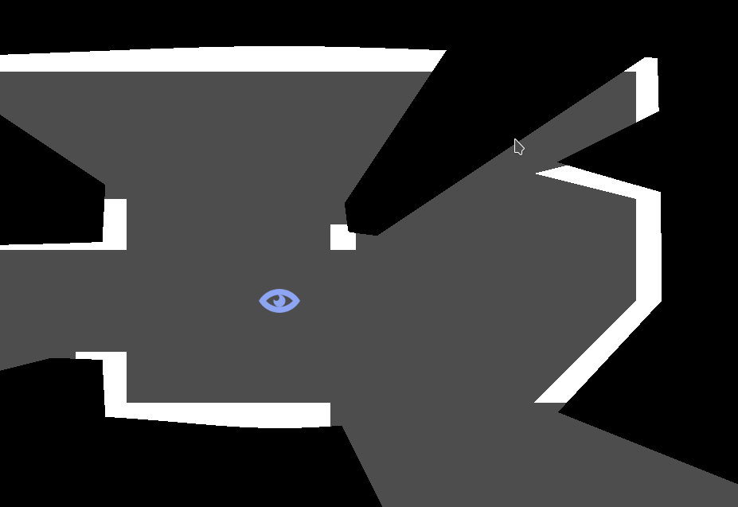

# Vision2D

  

A Godot plugin (version 4.x) for rendering 2d fields of vision, inspired by [Teleglitch](https://store.steampowered.com/app/234390/Teleglitch_Die_More_Edition/).

The plugin renders a number of polygons covering up parts of the screen that are outside the observer's field of vision.

The field of vision can be blocked with a `VisionOccluderLine` node or a `VisionOccluderPolygon` node:

*  `VisionOccluderLine` - Represents a line that blocks the field of vision. Extends [Line2D](https://docs.godotengine.org/en/4.4/classes/class_line2d.html).
*  `VisionOccluderPolygon` - Represents a polygon that blocks the field of vision. Extends [Polygon2D](https://docs.godotengine.org/en/4.4/classes/class_polygon2d.html).

Both nodes have the following properties:

* `observer: Node2D` - A `Node2D` representing the position of the observer.
* `shadow_color: Color` - Color of the shadow that covers up the screen.
* `size: float` - Size of the shade that covers up the screen.
* `penetration: float` - Determines how deep the vision can penetrate this occluder.
* `max_segment_size: float` - Max. size of the segment that casts the shadow (smaller segments -> more detail).

## Installation

1. Create an `addons` directory inside your project directory.
2. Get the plugin from the AssetLib or from GitHub
    * From the AssetLib: Open the AssetLib from the Godot editor and search for "Vision2D". Click download to install the plugin.
    * From GitHub: Run `git clone https://github.com/peter-kish/vision2d.git` and copy the contents of the `addons` directory to your projects `addons` directory.
4. Enable the plugin in `Project Settings > Plugins`.

